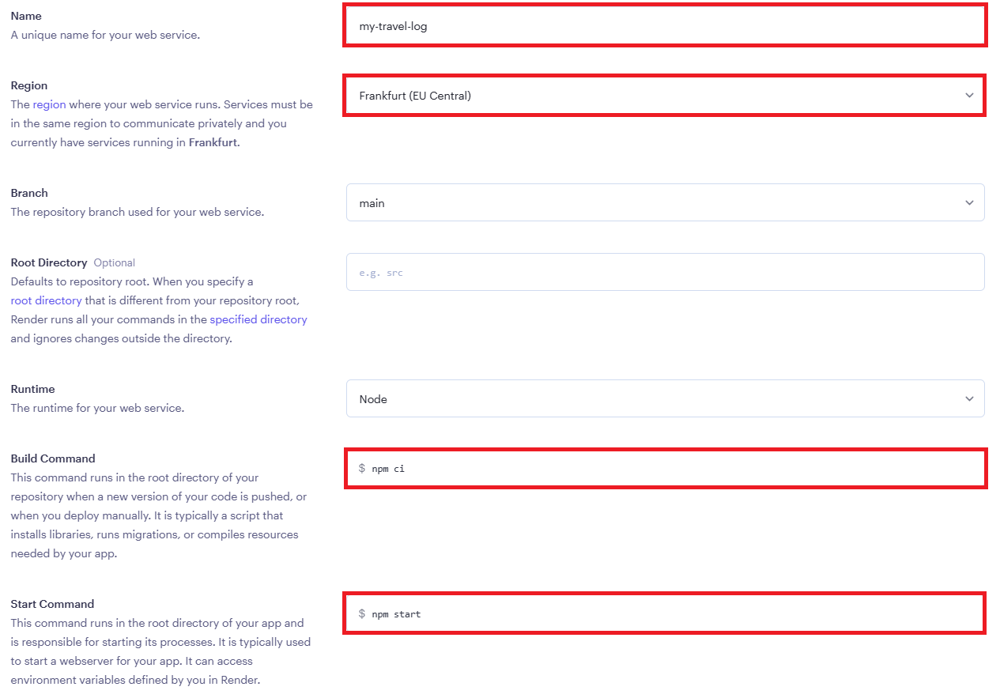
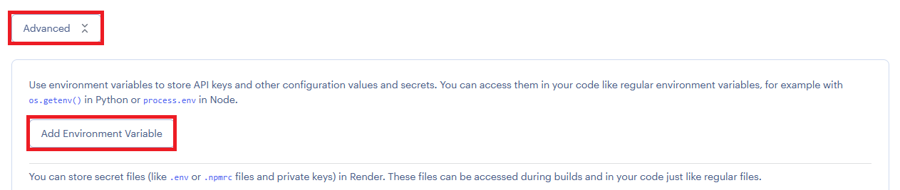
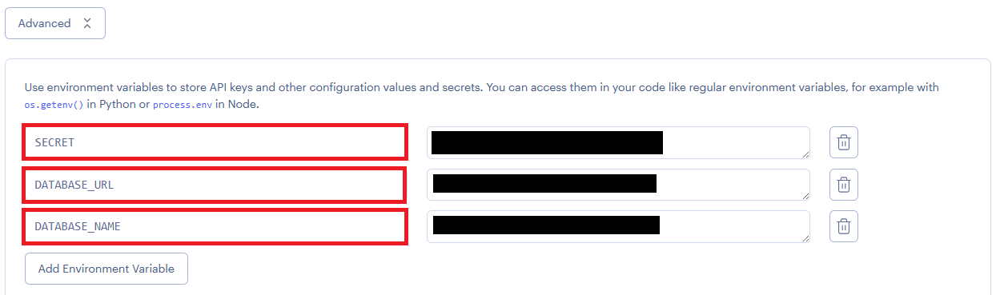

# Deploy your custom API in the cloud

This guide will walk you through the process of deploying your custom API
in the cloud. You will use [Render][render], a
[Platform-as-a-Service][paas] cloud, to run your application.

> **⚠ When working as a team, only one member of the team needs to follow this guide.**

## Requirements

* [Node.js][node] 18+
* [Git][git]
* A [GitHub][github] account

## Create your Render account

Register a [Render][render] account if you haven't already. If you register through GitHub, you will not have to link the two accounts together later.

Go to your dashboard and create a new Web Service:

Connect your GitHub repository to Render by selecting the one the contains your app from the list.

Name the application as you wish, choose the region and enter the commands used to build and start your app. The branch name should automatically be set to "main" or "master", depending on how your repository is setup.

Next, click the "Advanced" button to set up the required environment variables.

You'll need to create three environment variables:

| Name | Value |
| :--- | :--- |
| `SECRET` | Any string value. You can let Render generate a random value for you by clicking the "Generate" button |
| `DATABASE_URL` | The connection string for your database user. You should have or will soon receive it |
| `DATABASE_NAME` | The name of the database for your API. You should have or will soon receive it |
| `CORS` | `true` - Wether your API can be requested by an app hosted on another domain |

Once you submit the form, Render will automatically try to deploy your app. You will be able to see live logs. Pretty cool, but be aware that deploys on the free plan can take a little while. Be patient.

Once your deploy is live, you should be able to test your API at the URL generated by Render. It should look something like: `https://<your-app-name>.onrender.com`

Navigating to this URL will display your API doc.

> **Note that the URL in the examples might not match the actual URL of your deployed API**.

> Be careful if you copy/paste (which you probably will. I know you will).

You can test that everything is OK by going to `https://<your-app-name>.onrender.com/api/users` which should only display an empty json array.

🎉

[git]: https://git-scm.com
[github]: https://github.com
[render]: https://render.com
[node]: https://nodejs.org
[paas]: https://en.wikipedia.org/wiki/Platform_as_a_service
